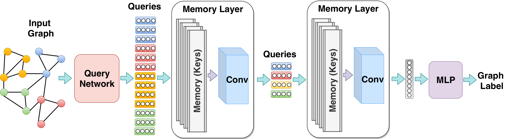

# GraphMemoryNet
Memory-Based Graph Networks

This work introduces an efficient memory layer to jointly learn representations and coarsen the input graphs.

It has been accepted at ICLR 2020: [https://openreview.net/forum?id=r1laNeBYPB](https://openreview.net/forum?id=r1laNeBYPB)





## Reference

```
@inproceedings{
Khasahmadi2020Memory-Based,
title={Memory-Based Graph Networks},
author={Amir Hosein Khasahmadi and Kaveh Hassani and Parsa Moradi and Leo Lee and Quaid Morris},
booktitle={International Conference on Learning Representations},
year={2020},
url={https://openreview.net/forum?id=r1laNeBYPB}
}
```
